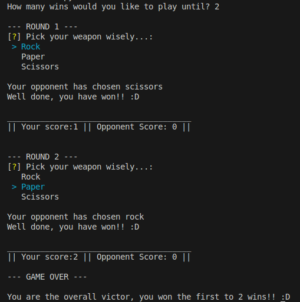

# Rock Paper Scissors (in Python)



## Summary

To practice my Python skills, I created a game of Rock, Paper, Scissors. The game includes an error handling loop at the beginning to ensure a valid integer is entered for the number of wins required to declare a winner. It then prompts the user for their choice in each round, selects a random choice for the computer, and continues until a winner is declared.

## Skills Demonstrated

- **Encapsulation**: All code is organized within function scopes to prevent unauthorized alteration of variables. This approach protects the integrity of the game's internal logic and facilitates modular programming.

- **Error Handling**: If the user fails to enter a valid number of wins to play for, they are informed and prompted to input it again. This ensures a smooth user experience by guiding them through proper input.

## Set Up

To get started with this project, follow the steps below:

### 1. Fork the Repository

First, you need to fork this repository to your GitHub account by clicking the "Fork" button near the top right of this page. If you are unfamiliar with this process, please follow this GitHub guide.

### 2. Clone the Repository
Next, clone the repository to your local machine using the following command. Make sure to replace your-username with your GitHub username:

git clone https://github.com/your-username/py-rock-paper-scissors

### 3. Running Python in VSC

The steps to run Python will depend on your system. If you are unfamiliar with how to do this, follow this [guide](https://code.visualstudio.com/docs/python/python-tutorial).

### 4. Installing Inquirer

You will need to install inquirer by doing the follow in terminal.

```
pip install inquirer
```

### 5. Have Fun

You should now be ready to run the game and see if you can beat the computer.
